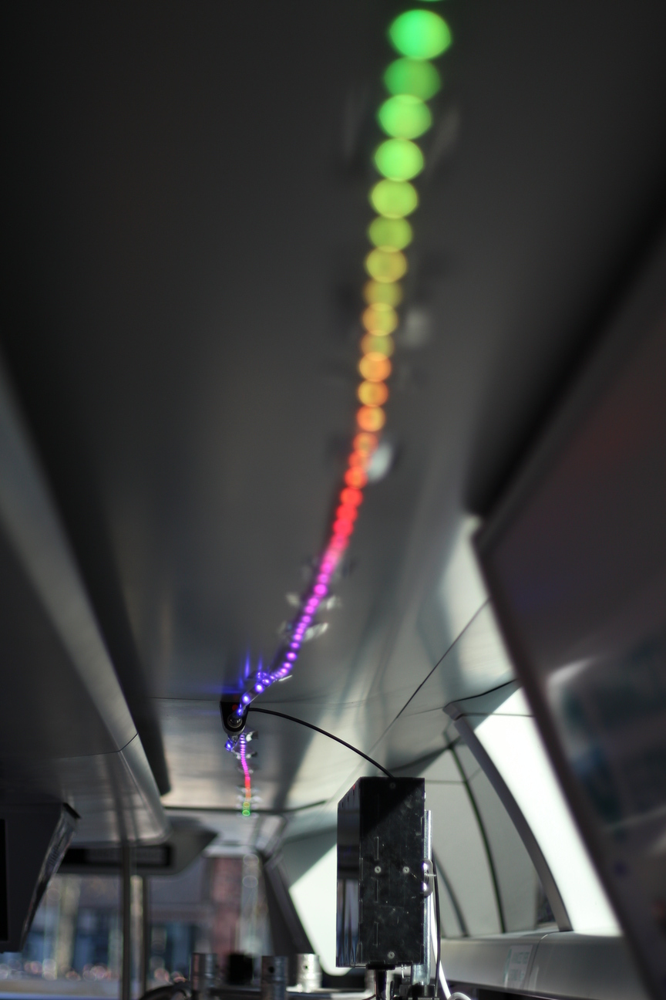
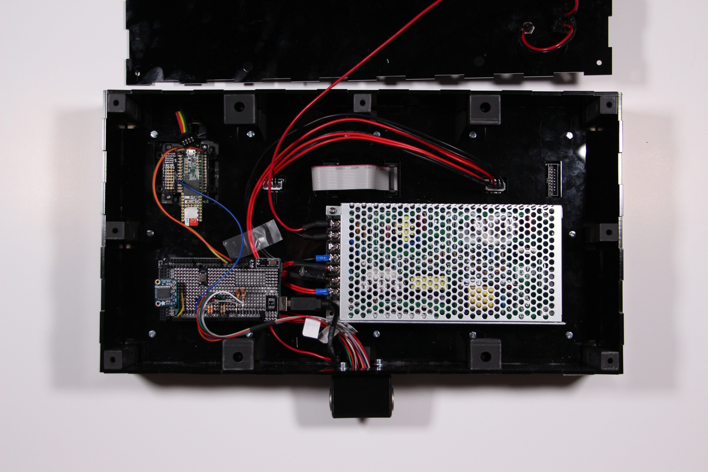
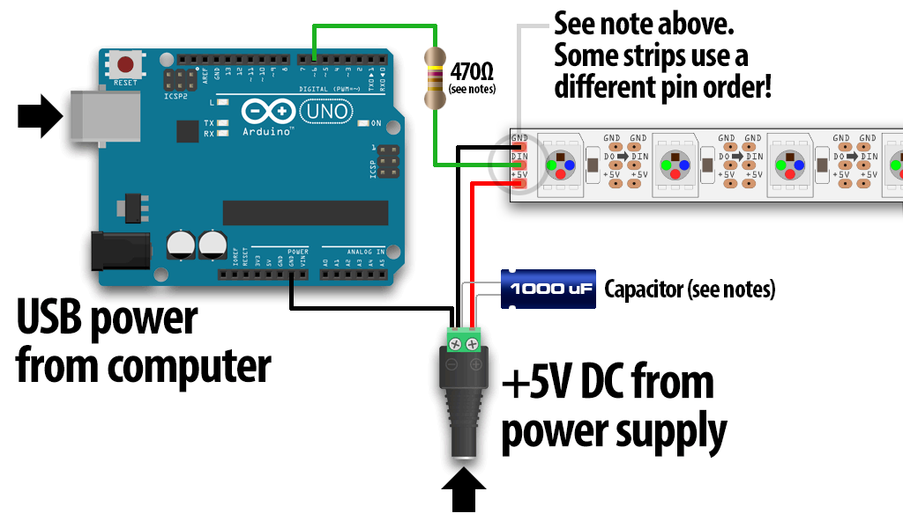
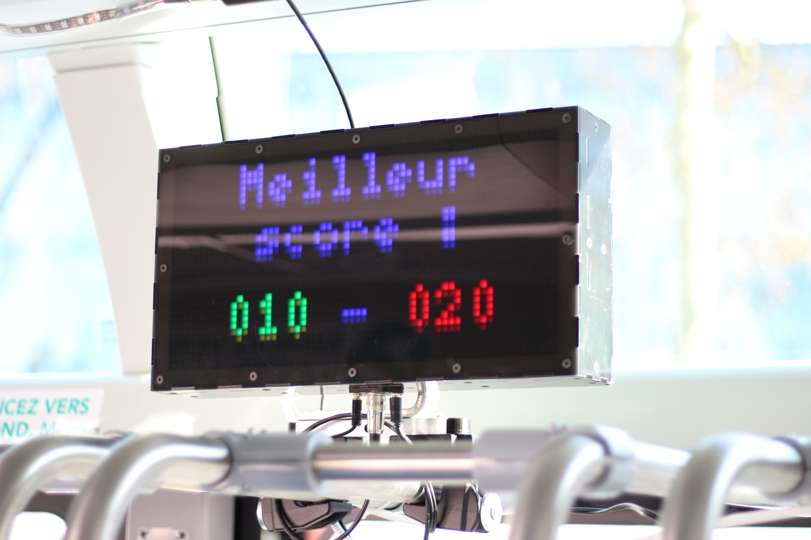
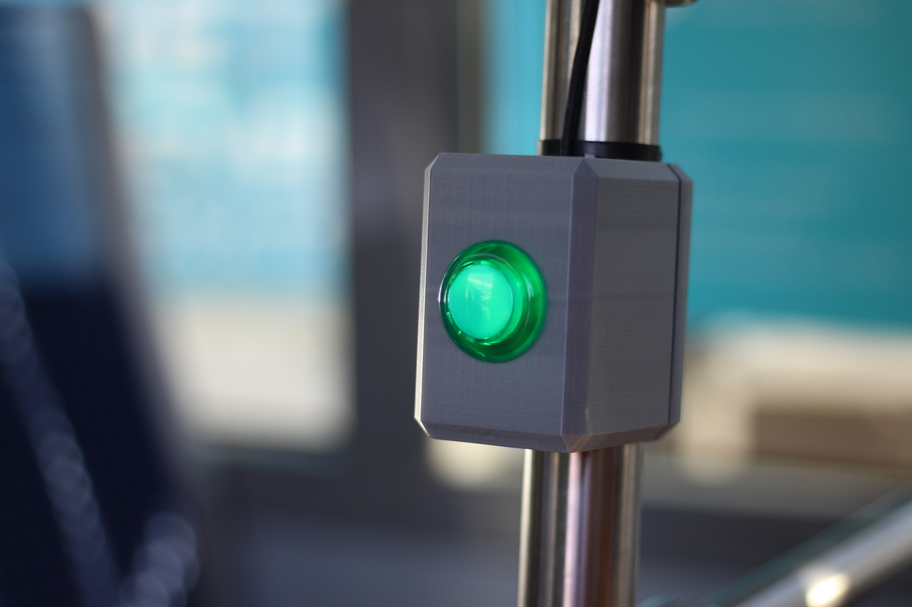

# StarLight
_StarLight_ est un jeu de ping-pong à une dimension où chaque joueur se renvoie la balle à tour de rôle. Un ruban de led multicolores permet de matérialiser les raquettes et la balle qui se déplace d’un côté à l’autre, tandis que les scores s’affichent sur un écran à matrice de led multicolore.

Créé lors du hackathon MétroMix 2017 à Rennes, ce jeu a été amélioré pour être intégré dans un bus lors de l’événement inOut 2019 à Rennes.

## Matériel nécessaire

__Attention : cette documentation est en cours de rédaction ...__

 * des plaques de PMMA noir opaques et translucides 3mm
 * une plaque de contreplaqué peuplier 3mm
 * du PLA pour les pièces imprimées en 3D
 * un Arduino Mega
 * une bande de LEDs RGB adressables de type *NeoPixel*
 * deux matrices de led 32 x 32
 * un Teensy 3.5
 * deux boutons d'arcade
 * une alimentation 220 V / 24 V (100W)
 * un condensateur électrolytique 1000 μF / 10 V
 * deux résistances 470 Ω
 * deux résistances 10 kΩ
 * deux condensateurs céramique 102 (1 nF)
 * un peu de câble ...

## Montage

L'ensemble des plans et des modèles 3D sont disponibles dans le dossier [models](models).

Les bandes de led sont alimentées en 5V et nécessitent la présence d'un condensateur de 1000 μF en parallèlele de l'alimentation.
On ajoute la résistance 470 Ω en série au signal.

## Liens utiles

 * [Documentation du projet MétroMix 2017](http://www.wiki-rennes.fr/M%C3%A9troMix_2017/StarLight) ;

## Photos dans le bus lors d'inOut 2019

